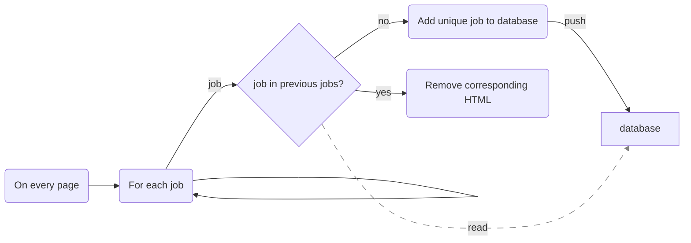

As indicated in this [Stack Overflow](https://stackoverflow.com/questions/74193851/scraping-glassdoor-returns-duplicate-entries) issue and from personal experience, Glassdoor's search results recycles job entries from a previous page onto the next page. 

Assuming each job listing can be broken down into parsable HTML chunks, the following flowchart should be sufficient to filter out any duplicate job entries:

Because the glassdoor frontend can change significantly from time to time, the implementation should use a library interface where the base logic code does not change but the underlying library responsible for parsing the HTML page does. 